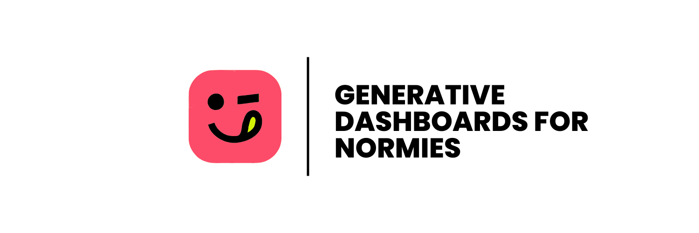

## 😜 Happycharts: Generative Dashboards for Normies


Welcome to Happycharts, a powerful yet user-friendly platform designed to help users create generative BI dashboards with ease. Happycharts leverages cutting-edge technologies to provide seamless integration with your data sources and powerful generative AI capabilities. This README will dive into the architecture, key components, and routes of Happycharts.

### 📐 Architecture

Happycharts is built on a modern tech stack that ensures scalability, security, and ease of use. Here's an overview of the core components:

#### Shadcn

Shadcn is used to build the UI components of Happycharts. It provides a robust and flexible foundation for creating a responsive and aesthetically pleasing user interface.

#### Clerk Auth

Clerk is integrated for authentication, ensuring secure and seamless user management. It handles user sign-up, login, and organization management, providing a smooth user experience.

#### Supabase

Supabase serves as the backend database and real-time server. It offers an easy-to-use interface for managing database operations, authentication, and real-time updates.

#### App Router

The App Router is used to manage the application's navigation and routing. It ensures smooth transitions between different sections of the dashboard and API routes.

### 🎛️ Dashboard Routes

Happycharts has several key routes for managing data sources and viewing dashboards:

#### `/dashboard/add-source`

This route allows users to add new data sources to their dashboard. Users can connect various data sources using Vercel AI's generative capabilities.

#### `/dashboard/home`

The home route serves as the main dashboard view, where users can see an overview of their data sources, charts, and analytics.

#### `/dashboard/saved-components`

This route allows users to view and manage their saved components, including charts, tables, and other data visualizations.

### ⚙️ API Routes

Happycharts provides API routes to manage data sources and handle chat interactions:

#### `/api/add-source`

This API route handles the addition of new data sources to the user's dashboard.

#### `/api/chat/`

This API route manages chat interactions, leveraging AI to assist users with queries and dashboard operations.

### 🪄 Vercel AI Functionality

Happycharts uses Vercel AI to provide generative charting capabilities through function calling. Here’s a deeper look into the Vercel AI logic:

#### Generative Charts via Function Calling

Zod schemas are used to ensure type safety and consistency in TypeScript, providing a robust foundation for validating API request and response structures.

**Connect to Database Tool**

```
tools: {
  connectToDatabase: {
    description: 'Connect to a database for the given organization.',
    parameters: z.object({
      organizationId: z.string().describe('The ID of the organization'),
      sourceId: z.string().describe('The ID of the data source'),
      credentials: z.string().describe('The credentials for the database'),
    }),
    execute: async ({ credentials, organizationId, sourceId }) => {
      const supabase = createClient();
      const org = auth().orgId;
    
      try {
        const { data, error } = await supabase
          .from('sources')
          .select('*, credentials(*)') // Assuming credentials is a nested object in the sources table
          .eq('id', sourceId)
          .single(); // Use .single() instead of .select() to return a single row
    
        if (error) throw error;
        if (!data) throw new Error('No source found');
    
        console.log('Data:', data); // Log the value of data
    
        const credentials = data.credentials;
    
        const client = createClickHouseClient(credentials);
    
        return client;
      } catch (error) {
        console.error(error);
        throw error;
      }
    },
  },
}
```

**FetchSchema Tool**
```
fetchSchema: {
  description: 'Fetch the schema for the connected database.',
  parameters: z.object({
    sourceId: z.string().describe('The ID of the data source'),
    client: z.any().describe('The ClickHouse client'),
  }),

  execute: async ({ client }: { client: any }) => {
    try {
      // Fetch tables
      const tablesResult = await client.query({
        query: 'SHOW TABLES',
        format: 'JSONEachRow',
      });
      const tables = await tablesResult.json();

      // Fetch columns for each table
      const schema: { tables: string[], columns: { [key: string]: string[] } } = {
        tables: [],
        columns: {},
      };

      for (const table of tables) {
        const tableName = (table as { name: string }).name;
        schema.tables.push(tableName);

        const columnsResult = await client.query({
          query: `DESCRIBE TABLE ${tableName}`,
          format: 'JSONEachRow',
        });
        const columns = await columnsResult.json();

        schema.columns[tableName] = columns.map((col: unknown) => (col as { name: string }).name);
      }
      return schema;
    } catch (error) {
      console.error('Error fetching schema:', error);
      throw new Error(`Failed to fetch schema: ${(error as Error).message}`);
    }
  },
}
```


**Create Query Tool**

```
createQuery: {
  description: 'Create and execute a query on the connected ClickHouse database.',
  parameters: z.object({
    sourceId: z.string().describe('The ID of the data source'),
    query: z.string().describe('The SQL query to execute'),
  }),

  execute: async ({ query, credentials }: { query: string, credentials: { url: string, username: string, password: string, database: string } }) => {
    const SUPABASE_SECRET_KEY = process.env.SUPABASE_SECRET_KEY!;

    const client = createClickHouseClient({
      url: credentials.url,
      username: credentials.username,
      password: credentials.password,
      database: credentials.database,
    });

    try {
      // Execute the query
      const result = await client.query({
        query,
        format: 'JSONEachRow',
      });

      // Parse the result
      const rows = await result.json();

      // Get column names from the first row
      const columns = rows.length > 0 ? Object.keys(rows[0] as object) : [];

      return {
        columns,
        rows,
        rowCount: rows.length,
      };
    } catch (error) {
      console.error('Error executing query:', error);
      throw new Error(`Failed to execute query: ${(error as Error).message}`);
    } finally {
      await client.close();
    }
  },
}
```

With these tools and functionalities, Happycharts offers a seamless experience for generating and managing BI dashboards. We hope this README helps you understand the architecture and capabilities of Happycharts. Happy charting!

### 🤝 Contributing Guidelines

Thank you for considering contributing to our project! Please follow these guidelines for smooth collaboration:

1. Fork the repository and create your branch from master.

2. Ensure your code adheres to our coding standards and conventions.

3. Test your changes thoroughly and add a test case in the tests folder.

4. Submit a pull request with a clear description of the problem and solution.